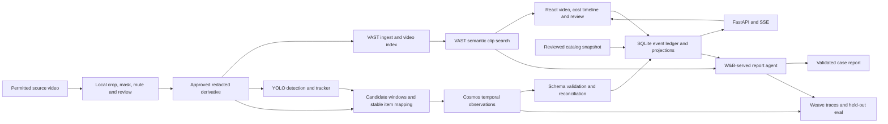

# Architecture

The application owns event validation, item identity, billing and reports. Sponsor services supply detections, observations, retrieval and language generation through replaceable adapters.



## Proposed layout after implementation

```text
frontend/                  React, TypeScript, Vite, components and browser tests
backend/app/               FastAPI routes, SQLite repository, workers, projections
backend/app/adapters/      vast, detection, cosmos, agent, weave, replay
backend/tests/             ledger, contracts, providers and privacy tests
config/                    non-secret stack configuration and catalog templates
fixtures/                  synthetic events and labels, permitted small metadata
media/redacted/            local approved derivatives, ignored by Git
media/raw/                 restricted local originals, never served, ignored by Git
runtime/                   SQLite, job receipts, eval output, ignored by Git
scripts/                   media preparation, seed, start, evaluate and export
docs/                      specifications and generated integration runbook
```

Frontend requests only the application API. Credentials, provider URLs containing secrets, catalog calculations and provider payloads remain server-side. Bind to localhost by default. One trusted local reviewer is sufficient for the hackathon; local controls are not hospital-grade authentication.

## Provider boundaries

| Adapter | Application operation | Returned information |
| --- | --- | --- |
| Media ingest | ingest approved derivative; poll readiness | asset ID, index status, permitted playback reference |
| Detection | detect/track frame or supplied asset | normalized boxes, class candidates, detector score, track ID |
| Reasoning | observe bounded video window plus track context | validated temporal observations, uncertainty, evidence description |
| Search | query scoped asset IDs | clip start/end, source ID, score and description |
| Report agent | explain a structured finalized case | narratives and review candidates referencing existing item/evidence IDs |
| Weave | trace operations; evaluate fixed labeled cases | versioned run reference, metrics and evaluation receipt |

These are internal interfaces, not claims about sponsor API endpoints. Implement HTTP/SDK translations from verified organizer examples in [STACK_ACCESS.md](STACK_ACCESS.md).

## Modes and provenance

- `fixture_replay`: synthetic ledger events, no model inference; video absent unless a specifically aligned fixture exists.
- `cached_inference`: previously recorded actual provider outputs for the same derivative hash and configuration, played over source time.
- `fresh_inference`: current provider calls on successive windows; measured lag displayed.

Footage origin is an independent field: organizer, public real OR, public simulated OR or staged. A real recording in replay mode does not make the replayed events inferred from it. Prevent unrelated fixture events from being overlaid on real footage.

## Jobs and time

Use a single durable worker with bounded concurrency initially; avoid Redis/Kafka for the first case. Persist ingest, detection and reasoning job states. Example initial window: 8 seconds, 2-second overlap; tune using actual model limits and observed action duration. Queue capacity starts at 20 windows. On overload, slow playback or pause intake and label lag; never silently skip observation windows and claim complete coverage.

All events carry source-relative milliseconds. Store processing timestamps separately in UTC. Provider clip times are translated through each window offset and validated against that window. SSE sequence numbers are transport order, not action time. Late use observations recompute the ledger projection and the timeline at their source times.

Seek changes the display cursor, not billing or job identity. A historical report can contain the full analyzed recording; a paced demo view only reveals events at or before its current cursor. Fresh inference only uses windows already received, with lag visible. Advancing through a processed recording is labeled replay or cached inference.

## Persistence and recovery

SQLite stores cases, catalog snapshots, item mappings, observations, events, reviews, jobs, search receipts and report revisions. Unique constraints protect event IDs and job keys. Use transactional projection updates. Restart/reconnect restores the same case; "Reset demo" explicitly creates a new case/run and tracker instance.

Case states: `READY -> RUNNING -> DRAINING -> CLOSED`. Closing first stops new intake, drains or explicitly marks failed jobs, reconciles unresolved items, then produces a finalized report. A failed or partial analysis can close with coverage warnings, never with inferred certainty. Later corrections append a new report revision.

## Demo targets

Targets, not measured guarantees: detection at 5 FPS for a fixed table; opening/use inference lag p95 <= 15 seconds on the selected clip; UI cost projection within 500 ms after event acceptance; report in <= 30 seconds after jobs drain. Record actual hardware/service deployment, video sampling, window duration, concurrency, p50/p95 and failed calls.
